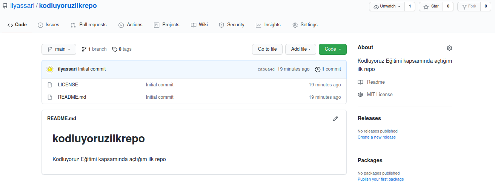

# kodluyoruzilkrepo
Bu repo [kodluyoruz](https://www.kodluyoruz.org/) Front-End Eğitiminde oluşturduğumuz ilk repo. İçerisinde bir ader README dosyası, bir adet de index.html barındırıyor.



## Installation

Öncelikle projeyi klonlayın
```
git clone https://github.com/ilyassari/kodluyoruzilkrepo
```

## Usage
Projeyi klonladıktan sonra Visual Studio Code programında açınız.

linux için  
```
cd kodluyoruzilkrepo
code
```

## Contributing
Pullrequestler kabul edilir. Büyük değişikler için, lütfen önce neyi değiştirmek istediğinizi tartışmak için bir konu açınız.

## License
[MIT](https://choosealicense.com/licenses/mit/)
